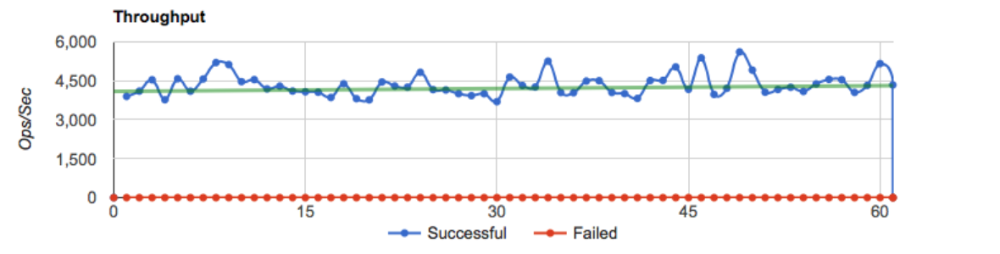
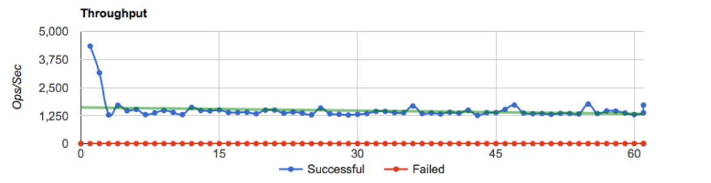

# Checmate Benchmarking

# Checmate vs Docker

### Test Details:

Parameter | Value
--- | --- | ---
*Duration* | `1 minute`
*Concurrency* | `3 Erlang workers`
*Key space(Redis)* | `1000000 keys`
*Value size(Redis)* | `1000 bytes`
*Operations* | `GET`

**Note:** A custom Redis [benchmarking driver](https://github.com/drewkerrigan/basho_bench/blob/ack-lighter/src/basho_bench_driver_redis.erl) was developed which opens a new connection for every single request. This was intentional to highlight the differnces between the different configurations.

### Checmate Throughput (ops/sec)

Full test results [here](0_get_modified.1)
Full graph (including latencies) [here](0_get_modified.1/summary.png)

### Docker Throughput (ops/sec)

Full test results [here](0_get_docker.1)
Full graph (including latencies) [here](0_get_docker.1/summary.png)

### Summary

../checmate/0_get_modified.1/ Mean Latency: 0.691701612903
../checmate/0_get_modified.1/Mean Ops/Sec: 4275.26673663

../checmate/0_get_docker.1/Mean Latency: 2.11771612903
../checmate/0_get_docker.1/Mean Ops/Sec: 1489.29169626

206.16035723% change in latency
-65.1649408561% change in ops/sec

Name | Mean Latency | Mean Ops/Sec
--- | --- | ---
*Checmate* | `0.69s` | `4275.27`
*Docker* | `2.12s` | `1489.29`

**67.34% decrease in latency for Checmate**
**187.07% increase in operations / second**